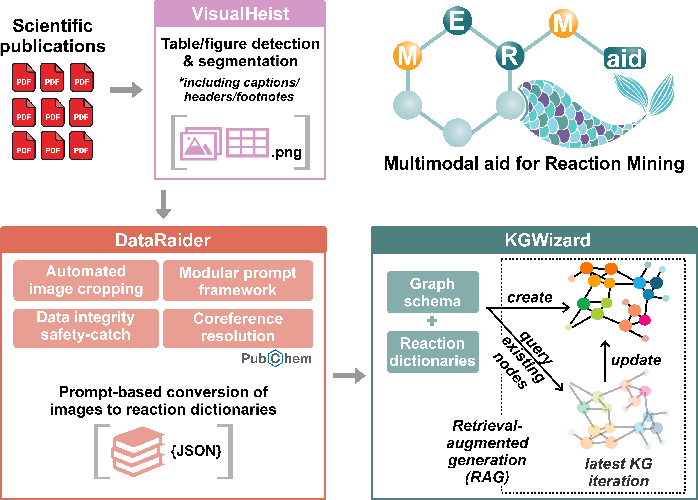

## MERMaid (Multimodal aid for Reaction Mining)



### Table of Contents  
1. [Overview](#1-overview)  
2. [Installation](#2-installation)  
3. [Usage](#3-usage)  
1. [Overview](#1-overview)  
2. [Installation](#2-installation)  
3. [Usage](#3-usage) 
4. [Running the web app](#4-running-the-mermaid-web-app-recommended-for-new-users)
 
## 1. Overview  
MERMaid is an end-to-end knowledge ingestion pipeline to automatically convert disparate information conveyed through figures, schemes, and tables across various PDFs into a coherent and machine-actionable knowledge graph. It integrates three sequential modules:  
- **VisualHeist** for table and figure segmentation from PDFs  
- **DataRaider** for multimodal analysis to extract relevant information as structured reaction schema  
- **KGWizard** for automated knowledge graph construction  

You can run MERMaid directly or use VisualHeist and DataRaider as standalone tools for their specific functionality.  

> ⚠️ MERMaid is integrated with the OpenAI provider at present. Please ensure that you have **sufficient credits in your account** otherwise you will encounter [errors](https://github.com/aspuru-guzik-group/MERMaid/issues/3) (Note: running VisualHeist by itself does not require an API key). We will extend MERMaid to support other providers and open-source VLMs in future updates.  

VisualHeist works best on systems with **high RAM**. For optimal performance, ensure that your system has sufficient memory, as running out of memory may cause the process to be terminated prematurely.  

Further usage details on KGWizard can be found in the [KGWizard README file](https://github.com/aspuru-guzik-group/MERMaid/blob/main/src/kgwizard/README.org).  

---
If you use MERMaid and its submodules in your research, please cite our [preprint](https://doi.org/10.26434/chemrxiv-2025-8z6h2). Note that this content is a preprint and has not been peer-reviewed.
```
@article{
    MERMaid,
    title = {MERMaid: Universal multimodal mining of chemical reactions from PDFs using vision-language models},
    author = {Shi Xuan Leong, Sergio Pablo-García, Brandon Wong, Alán Aspuru-Guzik},
    DOI = {10.26434/chemrxiv-2025-8z6h2},
    journal = {ChemRxiv},
    year = {2025},
}  
```
---
## 2. Installation  

### 2.1 Create a new virtual environment  
The recommended Python version is **3.9**.  

#### Using Conda:
```sh
conda create -n mermaid-env python=3.9
conda activate mermaid-env
```
#### Using venv:
```sh
python3.9 -m venv mermaid-env
source mermaid-env/bin/activate
```

### 2.2 Install RxnScribe for Optical Chemical Structure Recognition  
This module is required to extract the SMILES strings of reactants and products. 
```sh
git clone https://github.com/thomas0809/RxnScribe.git
cd RxnScribe
pip install -r requirements.txt
python setup.py install
cd ..
```
> ⚠️ You may see a compatibility warning about `MolScribe version 1.1.1 not being compatible with Torch versions >2.0`. This can be safely ignored.  

### 2.3 Install MERMaid    
Download the repository and install dependencies:  
```sh
git clone https://github.com/aspuru-guzik-group/MERMaid/
cd MERMaid
pip install -e .
```
For the **full MERMaid pipeline**:  
```sh
pip install MERMaid[full]
```
For **individual modules**:  
```sh
pip install MERMaid[visualheist]
pip install MERMaid[dataraider]
pip install MERMaid[kgwizard]
```

---

## 3. Usage    

### 3.1 Setting Up Your Configuration File  

**Define custom settings in `scripts/startup.json`:** 
- `pdf_dir`: Full path to directory where PDFs are stored (required for running VisualHeist).
- `image_dir`: Full path to directory to store extracted images or where images are currently stored (required for running DataRaider).
- `json_dir`: Full path to directory to store JSON output (required for running DataRaider and/or KGWizard).
- `graph_dir`: Full path to directory to store graph files (required for running KGWizard).
- `prompt_dir`: Full path to directory containing prompt files (required for running DataRaider).
- `model_size`: Choose between 'base' or 'large' (required for running VisualHeist).
- `keys`: List of reaction parameter keys (required for running DataRaider).
- `new_keys`: Additional keys for new reactions (required for running DataRaider).
- `graph_name`: Name for the generated knowledge graph (required for running KGWizard).
- `schema`: User-prepared schema for the knowledge graph (required for running KGWizard).

**Additional notes:** 
- The in-built reaction parameter keys are in `Prompts/inbuilt_keyvaluepairs.txt`.  
- For post-processing extracted JSON reaction dictionaries:  
  - Modify `COMMON_NAMES` in `dataraider/postprocess.py` to add custom chemical names.  
  - Modify `KEYS` in `dataraider/postprocess.py` to clean specific key names.  
- Customize `filter_prompt` in `Prompts/` to filter relevant images.  
- You can use one of our prepared schema found in `src/kgwizard/graphdb/schemas`

### 3.2 Setting Up API Key  
### 3.2 Setting Up API Key  
The environment variable **`OPENAI_API_KEY`** is required for **DataRaider** and **KGWizard**. You can set this variable in your terminal session using the following command:

```sh
export OPENAI_API_KEY="your-openai-api-key"
```
This method sets the API key for the current terminal session, and the environment variable will be available to any processes started from that session. 

Alternatively, you can create a `.env` file in the root directory of the MERMaid project (the same directory where `README.md` is located) and add the following line to it: 

```sh
OPENAI_API_KEY="your-openai-api-key"
```
This will automatically set the OPENAI_API_KEY environment variable whenever you run the project.

---

### 3.3 Running the Full MERMaid Pipeline  
### 3.3 Running the Full MERMaid Pipeline  
Run the full pipeline with:  
```sh
mermaid
```
Intermediate files will be saved in the `Results/` directory.  

### 3.4 Running Individual Modules    

#### 3.4.1 VisualHeist – Image Segmentation from PDFs  
```sh
visualheist
```
 
#### 3.4.2 DataRaider – Image-to-Data Conversion  
```sh
dataraider
```
*A sample output JSON is available in the `Assets` folder.*  

#### 3.4.3 KGWizard – Data-to-Knowledge Graph Translation  
```sh
kgwizard
```
---

### 4 Running the MERMaid Web App (Recommended for New Users)

MERMaid comes with a web interface for running the modules interactively via a browser. 
You can configure your input folders, select extraction keys, and run modules with no coding required.

To launch the app locally:
```sh
./launch_webapp.sh
```

Then, open http://localhost:850x in your browser.

> You must have your **`OPENAI_API_KEY`** set in your .env file (or terminal) before launching the app. You can follow the instructions in [3.2 Setting Up API Key](#32-setting-up-api-key) 